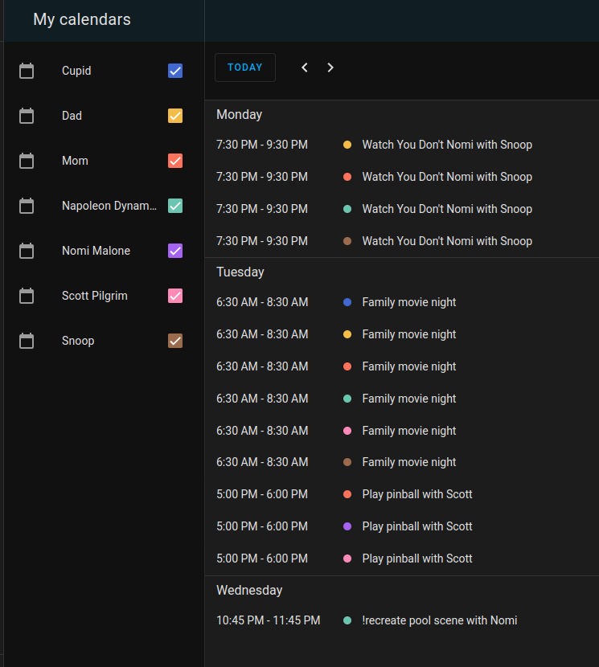

# family_calendar_sync

[Family Calendar Sync](https://github.com/McCroden/family_calendar_sync) is a custom component for Home Assistant that will sync `parent` calendars to `child` calendars. It also keeps the calendars in sync---create an automation using the `family_calendar_sync` service on a recurring basis.

The idea is to read from one or more `parent` calendar entities then copy the events to one or more `child` calendar entities. All of the events can be copied. Or just those that match a simple list of keywords, such as a name. It keeps them in sync by computing a hash of the `parent` calendar events and storing the first 8 characters of the hash in the description of the event on the `child` calendar.

## Features

- Copy events from one calendar to another and keep them in sync (by using an automation)
- Will delete events from `child` calendars
- If an event is added to a `child` calendar, it will not be harmed by this service

## Install

Use HACS to install this component.

### Configuration

This component uses the `configuration.yaml` file. 

In the example configuration below, we have:
- Napoleon Dynamite (dad)
- Nomi Malone (mom)
- Snoop (child)
- Scott Pilgrim (child)
- Cupid (child)
- Mom (child)+
- Dad (child)+

\+ We also created a Local Calendar entity for mom and dad, because the kids like to see what mom and dad have going on in their day too.


Here's an example configuration:

```yaml
family_calendar_sync:
  options:
    days_to_sync: 7
    ignore_event_if_title_starts_with: '!'
  parent:
    - entity_id: calendar.napoleon_dynamite
    - entity_id: calendar.nomi_malone
  child:
    - entity_id: calendar.dad
      copy_all_from:
        entity_id: calendar.napoleon_dynamite
      keywords:
        - dad
        - napoleon
        - family
    - entity_id: calendar.mom
      copy_all_from:
        entity_id: calendar.nomi_malone
      keywords:
        - mom
        - nomi
        - family
    - entity_id: calendar.snoop
      keywords:
        - snoop
        - family
        - kids
        - kiddos
    - entity_id: calendar.scott_pilgrim
      keywords:
        - scott
        - family
        - kids
        - kiddos
    - entity_id: calendar.cupid
      keywords:
        - cupid
        - family
        - kids
        - kiddos
```

Here is what the synced calendar looks like:



#### `options`

- `days_to_sync`: (optional) number of days to sync calendars, default 7
- `ignore_event_if_title_starts_with`: (optional) sometimes the kids don't need to know everything going on. Use this option and a specific character or string of characters and if an event starts with that character or string, it will be ignored from the sync. This applies to all `parent` calendars

#### `parent`

Just provide the entity IDs for the `parent` or calendars you want to copy events from.

#### `child`

- `entity_id`: (required) entity ID of the calendar to sync events to
- `keywords`: (required) list of keywords used for matching. Only the event title's are searched for these keywords
- `copy_all_from`: (optional) copy all events from the `entity_id` provided
    - `entity_id`: (required) the entity ID to copy all events but the `ignore_event_if_title_starts_with` still applies

### Service

There's a `family_calendar_sync` service. This is what you would use in an automation to have them stay in sync. In the automation, you can specify how frequently the sync occurs.

## TODO

- Create tests
- Add check if child calendar is CalDAV and raise error because Home Assistant cannot create events on CalDAV entity.
- See if we can run sync on any event change within the time period being synced (default 7 days).

